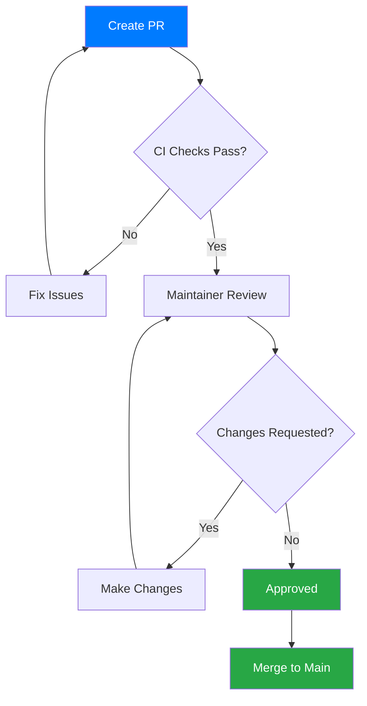
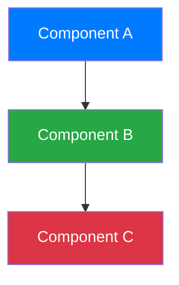

# Contributing to StreamCondor

Thank you for considering contributing to StreamCondor! This document provides guidelines and instructions for contributing.

## Table of Contents

- [Code of Conduct](#code-of-conduct)
- [How Can I Contribute?](#how-can-i-contribute)
- [Getting Started](#getting-started)
- [Development Process](#development-process)
- [Pull Request Process](#pull-request-process)
- [Coding Standards](#coding-standards)
- [Commit Messages](#commit-messages)
- [Testing Guidelines](#testing-guidelines)
- [Documentation](#documentation)

## Code of Conduct

### Our Pledge

We are committed to providing a welcoming and inclusive environment for everyone, regardless of:
- Age, body size, disability, ethnicity, gender identity and expression
- Level of experience, education, socio-economic status
- Nationality, personal appearance, race, religion
- Sexual identity and orientation

### Our Standards

**Positive Behavior**:
- Using welcoming and inclusive language
- Being respectful of differing viewpoints
- Gracefully accepting constructive criticism
- Focusing on what's best for the community
- Showing empathy towards other community members

**Unacceptable Behavior**:
- Trolling, insulting/derogatory comments, and personal attacks
- Public or private harassment
- Publishing others' private information without permission
- Other conduct which could be considered inappropriate

## How Can I Contribute?

### Reporting Bugs

Before submitting a bug report:
1. Check existing issues to avoid duplicates
2. Gather relevant information (OS, Python version, logs)
3. Create a minimal reproducible example

**Bug Report Template**:
```markdown
**Description**
Clear description of the bug.

**Steps to Reproduce**
1. Step one
2. Step two
3. Step three

**Expected Behavior**
What should happen.

**Actual Behavior**
What actually happens.

**Environment**
- OS: [e.g., Ubuntu 22.04]
- Python: [e.g., 3.12.0]
- StreamCondor: [e.g., 1.0.0]
- Streamlink: [e.g., 8.0.0]

**Logs**
```
Paste relevant log output here
```
```

### Suggesting Enhancements

Enhancement suggestions are tracked as GitHub issues. When creating an enhancement suggestion, include:

- **Clear title** describing the enhancement
- **Detailed description** of the proposed functionality
- **Use case** explaining why it would be useful
- **Possible implementation** if you have ideas
- **Alternative solutions** you've considered

**Enhancement Template**:
```markdown
**Enhancement Description**
Clear description of the proposed feature.

**Use Case**
Why would this be useful? Who would benefit?

**Proposed Implementation**
How might this work?

**Alternatives Considered**
Other approaches you've thought about.
```

### Contributing Code

Areas where contributions are especially welcome:

#### High Priority
- 🧪 **Unit Tests** - Test coverage for core modules
- 🌐 **Platform Support** - Additional streaming platforms
- 📚 **Documentation** - Guides, examples, troubleshooting
- 🎨 **UI Improvements** - Icons, dark mode, accessibility

#### Medium Priority
- ⚡ **Performance** - Parallel checking, caching optimizations
- 🔧 **Features** - Recording, notification templates, statistics
- 🌍 **Internationalization** - Multi-language support

#### Low Priority
- 🔗 **Integrations** - Discord, OBS, webhooks
- 📦 **Packaging** - Flatpak, AppImage, Snap
- 🚀 **Advanced Features** - Multi-profile, analytics

## Getting Started

### Development Setup

1. **Fork the repository** on GitHub

2. **Clone your fork**:
  ```bash
  git clone https://github.com/tarzasai/StreamCondor.git
  cd StreamCondor
  ```

3. **Add upstream remote**:
  ```bash
  git remote add upstream https://github.com/tarzasai/StreamCondor.git
  ```

4. **Set up development environment**:
   ```bash
   bash setup_dev.sh
   # Or manually:
   python3 -m venv .venv
   source .venv/bin/activate
   pip install -r requirements.txt
   ```

5. **Verify setup**:
   ```bash
   python src/main.py --help
   ```

### Development Dependencies

```bash
# Optional: Install development tools
pip install black pylint mypy pytest pre-commit
```

## Development Process

### Branching Strategy

```mermaid
gitgraph
   commit id: "main"
   branch feature/new-feature
   checkout feature/new-feature
   commit id: "Add feature"
   commit id: "Tests"
   checkout main
   merge feature/new-feature
   commit id: "Release"
```

**Branch Naming**:
- `feature/description` - New features
- `fix/description` - Bug fixes
- `docs/description` - Documentation
- `refactor/description` - Code refactoring
- `test/description` - Test additions

**Example**:
```bash
git checkout -b feature/add-kick-support
```

### Keeping Your Fork Updated

```bash
# Fetch upstream changes
git fetch upstream

# Merge into your main branch
git checkout main
git merge upstream/main

# Update your feature branch
git checkout feature/your-feature
git rebase main
```

## Pull Request Process

### Before Submitting

- [ ] Code follows project style guide (see [Coding Standards](#coding-standards))
- [ ] All tests pass
- [ ] New code has appropriate tests
- [ ] Documentation updated if needed
- [ ] Commit messages follow conventions
- [ ] No merge conflicts with main branch

### PR Checklist

1. **Create descriptive title**:
   ```
   [Category] Brief description

   Examples:
   [Feature] Add support for Kick.com streams
   [Fix] Resolve favicon caching issue
   [Docs] Add troubleshooting guide
   ```

2. **Fill out PR template**:
   ```markdown
   ## Description
   Brief overview of changes and motivation.

   ## Changes
   - Specific change 1
   - Specific change 2
   - Specific change 3

   ## Testing
   How were these changes tested?

   ## Related Issues
   Fixes #123
   Closes #456

   ## Screenshots (if applicable)

   ## Checklist
   - [ ] Code follows style guide
   - [ ] Tests added/updated
   - [ ] Documentation updated
   - [ ] No breaking changes
   ```

3. **Request review** from maintainers

4. **Address feedback** promptly and professionally

5. **Squash commits** if requested before merge

### Review Process



## Coding Standards

### Python Style Guide

Follow **PEP 8** with project-specific conventions:

#### Indentation and Formatting

```python
# Use 2 spaces for indentation
def example_function():
  if condition:
    do_something()
    if nested:
      do_more()

# Maximum line length: 120 characters
very_long_function_name(param1, param2, param3, param4, param5)  # OK if under 120

# For longer lines, use proper wrapping:
result = very_long_function_name(
  first_parameter, second_parameter,
  third_parameter, fourth_parameter
)
```

#### Naming Conventions

```python
# Functions and variables: snake_case
def check_stream_status(stream_url: str) -> bool:
  is_online = False
  return is_online

# Classes: PascalCase
class StreamMonitor(QThread):
  pass

# Constants: UPPER_CASE
MAX_RETRY_COUNT = 5
DEFAULT_CHECK_INTERVAL = 60

# Private methods: _leading_underscore
def _internal_helper(self) -> None:
  pass
```

#### Type Hints

**Use Python 3.12 native syntax**:

```python
# Good - Native types
def process_streams(
  streams: list[dict[str, Any]],
  threshold: float = 0.5
) -> list[str]:
  return [s['url'] for s in streams]

# Good - Union operator
def get_config(key: str) -> str | int | None:
  return config.get(key)

# Avoid - Old typing module
from typing import List, Dict, Optional, Union
def old_style(items: List[Dict[str, str]]) -> Optional[int]:
  pass
```

#### Docstrings

```python
def launch_stream(stream: dict[str, Any], quality: str = 'best') -> bool:
  """Launch a stream with specified quality.

  Args:
    stream: Stream configuration dictionary with url, name, type.
    quality: Stream quality preference (best, 720p, etc.).

  Returns:
    True if launch successful, False otherwise.

  Raises:
    ValueError: If stream URL is invalid.
    FileNotFoundError: If player executable not found.
  """
  pass
```

#### Imports

```python
"""Module docstring."""

# Standard library (alphabetical)
import json
import logging
from pathlib import Path

# Third-party packages (alphabetical)
from PyQt6.QtCore import QThread, pyqtSignal
from PyQt6.QtWidgets import QSystemTrayIcon
import streamlink

# Local modules (alphabetical)
from .configuration import Configuration
from .resources import resource_path

# Module constants
LOG = logging.getLogger(__name__)
DEFAULT_TIMEOUT = 30
```

### Code Quality Tools

```bash
# Format code (optional)
black --line-length 120 src/

# Lint code (optional)
pylint src/

# Type check (optional)
mypy src/
```

## Commit Messages

### Format

```
[Category] Brief description (50 chars or less)

More detailed explanation if needed (wrap at 72 chars).
Explain what and why, not how (code shows how).

- Bullet points are okay
- Use present tense ("Add feature" not "Added feature")
- Reference issues: Fixes #123, Closes #456
```

### Categories

- `[Feature]` - New feature
- `[Fix]` - Bug fix
- `[Docs]` - Documentation only
- `[Refactor]` - Code restructuring without behavior change
- `[Test]` - Adding or updating tests
- `[Chore]` - Maintenance tasks (dependencies, build, etc.)
- `[Style]` - Formatting, whitespace (no code change)

### Examples

**Good commits**:
```bash
[Feature] Add support for Kick.com platform

Implements stream detection and launching for Kick.com streams.
Adds platform-specific URL parsing and icon fetching.

Closes #234

[Fix] Resolve favicon caching race condition

Adds mutex lock when writing to favicon cache directory to prevent
concurrent write conflicts that caused corrupted images.

Fixes #123

[Docs] Add troubleshooting section to README

Includes common issues and solutions based on user feedback.
```

**Bad commits** (avoid these):
```bash
fix bug          # Too vague
WIP              # Don't commit work-in-progress
Fixed stuff      # Unclear what was fixed
```

## Testing Guidelines

### Manual Testing

Before submitting PR, test these workflows:

- [ ] Application starts without errors
- [ ] Tray icon appears and is clickable
- [ ] Settings window opens and saves changes
- [ ] Stream monitoring detects online/offline status
- [ ] Notifications appear when streams go live
- [ ] Stream launching opens correct player
- [ ] All menu actions work as expected

### Testing Checklist for New Features

- [ ] Feature works on Linux (if possible)
- [ ] Feature works on Windows (if possible)
- [ ] Feature works on macOS (if possible)
- [ ] No regression in existing functionality
- [ ] Error cases handled gracefully
- [ ] User-facing messages are clear

### Writing Tests (Future)

When unit testing is implemented:

```python
# test/test_launcher.py
import pytest
from src.launcher import StreamLauncher
from src.configuration import Configuration

def test_command_building():
  """Test streamlink command construction."""
  config = Configuration()
  launcher = StreamLauncher(config)

  stream = {
    'url': 'https://www.twitch.tv/test',
    'quality': 'best',
    'sl_args': '--retry-max 5'
  }

  command = launcher.build_command(stream)
  assert 'streamlink' in command
  assert stream['url'] in command
  assert 'best' in command
```

## Documentation

### When to Update Documentation

Update docs when you:
- Add new features or configuration options
- Change existing behavior
- Fix bugs that affect usage
- Add new dependencies

### Documentation Files

- **README.md** - Overview, quick start, basic usage
- **doc/architecture.md** - System design, components
- **doc/data-flow.md** - Data flows and interactions
- **doc/development.md** - Development setup and workflow
- **doc/configuration.md** - Configuration reference
- **Code comments** - Complex logic, non-obvious decisions

### Documentation Style

```markdown
# Use clear headings

## Organize hierarchically

### Include code examples

```bash
# Use syntax highlighting
python src/main.py --help
```

**Bold for emphasis**, *italic for terms*.

- Bullet points for lists
- Keep sentences concise
- Use active voice

Use Mermaid diagrams for:
- Architecture overviews
- Flow diagrams
- Sequence diagrams
```

### Mermaid Diagram Guidelines



**Requirements**:
- Always set **both** `fill` and `color` for dark mode compatibility
- Use descriptive labels
- Keep diagrams simple and focused
- Test rendering in GitHub

## Getting Help

### Resources

- **Documentation** - Start with README and doc/ directory
- **Issues** - Search existing issues for similar problems
- **Discussions** - Ask questions in GitHub Discussions
- **Code Examples** - Check test/ directory

### Contact

- **GitHub Issues** - Bug reports and feature requests
- **GitHub Discussions** - Questions and general discussion
- **Pull Requests** - Code contributions

### Response Times

We aim to:
- Acknowledge issues within **48 hours**
- Review PRs within **1 week**
- Release updates **monthly** (or as needed for critical fixes)

## Recognition

Contributors will be:
- Listed in project contributors
- Mentioned in release notes
- Recognized in README (for significant contributions)

## License

By contributing, you agree that your contributions will be licensed under the project's MIT License.

---

Thank you for contributing to StreamCondor! 🎉
