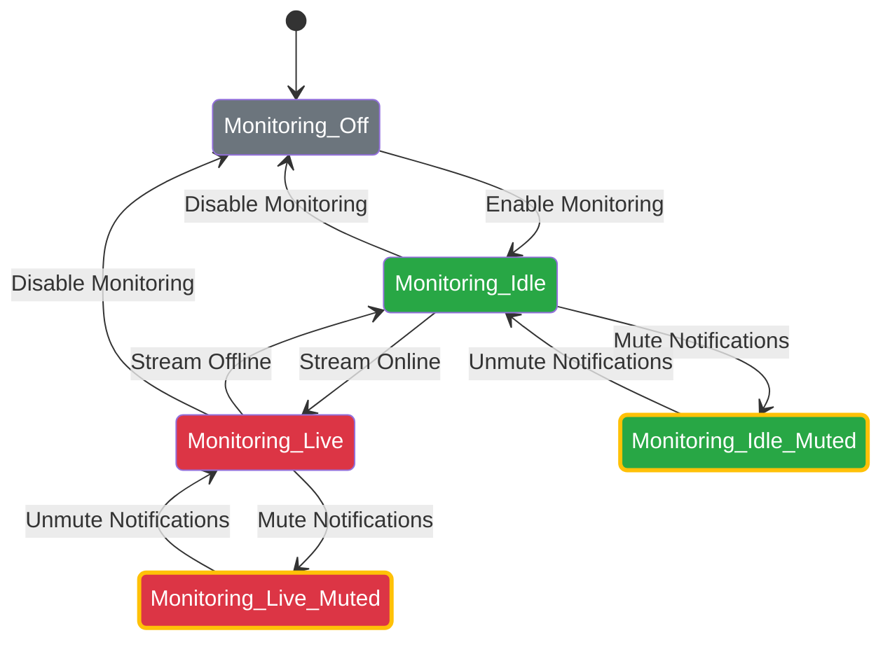
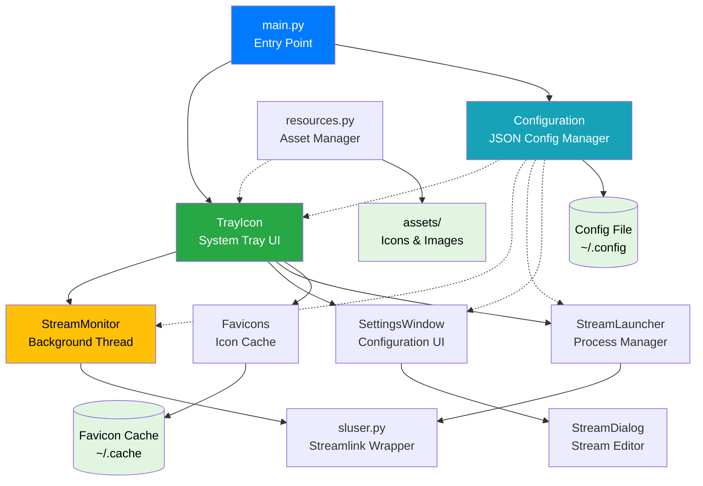

# StreamCondor

A lightweight system tray application for monitoring livestreams across multiple platforms using [streamlink](https://streamlink.github.io/).

## Features

- 🔔 **Real-time Stream Monitoring** - Automatically detect when your favorite streamers go live
- 🎯 **Multi-platform Support** - Works with Twitch, YouTube and any streamlink-supported platform
- 🖥️ **System Tray Integration** - Unobtrusive monitoring with visual status indicators
- 🎨 **Custom Player Support** - Launch streams with mpv, VLC, or your preferred media player
- ⚙️ **Flexible Configuration** - Per-stream settings for quality, notifications, and streamlink arguments
- 🌐 **Favicon Support** - Automatic platform icon fetching and caching
- 📋 **Clipboard Integration** - Quick stream launching from copied URLs

## Table of Contents

- [Prerequisites](#prerequisites)
- [Installation](#installation)
- [Quick Start](#quick-start)
- [Usage](#usage)
- [Configuration](#configuration)
- [Architecture](#architecture)
- [Development](#development)
- [Contributing](#contributing)
- [License](#license)

## Prerequisites

- **Python 3.12+** - Modern Python with native type hints
- **streamlink** - Stream extraction tool
- **PyQt6** - GUI framework
- **Media Player** - mpv or VLC recommended

## Installation

### From Source

```bash
# Clone the repository
git clone https://github.com/yourusername/streamcondor.git
cd streamcondor

# Run the setup script
bash setup_dev.sh

# Or manually:
python3 -m venv .venv
source .venv/bin/activate
pip install -r requirements.txt
```

### Using pip (when published)

```bash
pip install streamcondor
```

## Quick Start

1. **Launch the application**:
   ```bash
   python src/main.py
   ```

2. **Configure your first stream**:
   - Right-click the system tray icon
   - Select "Settings"
   - Click "Add" in the Streams tab
   - Enter a stream URL (e.g., `https://www.twitch.tv/username`)
   - Enter the name of the stream
   - Click "Save"

3. **Monitor streams**:
   - The tray icon changes color when streams go live
   - Left-click the tray icon (configurable action)
   - Right-click to access the context menu

## Usage

### Tray Icon States



### Context Menu Options

- **Open URL** - Launch a stream from clipboard or manual entry
- **[Online Streams]** - Quick access to currently live streams
- **Monitoring** - Toggle stream monitoring on/off
- **Notifications** - Toggle desktop notifications
- **Settings** - Open configuration window
- **Quit** - Exit application

### Command-line Options

```bash
python src/main.py [OPTIONS]

Options:
  -c, --config PATH     Path to custom configuration file
  -l, --log-level LEVEL Set logging verbosity (DEBUG, INFO, WARNING, ERROR)
  -h, --help           Show help message
```

### Configuration File Location

Default configuration path:
- **Linux**: `~/.config/StreamCondor.json`
- **Windows**: `%APPDATA%\StreamCondor.json`
- **macOS**: `~/Library/Application Support/StreamCondor.json`

## Configuration

### Stream Configuration

Each stream supports the following options:

```json
{
  "url": "https://www.twitch.tv/username",
  "name": "Display Name",
  "type": "twitch",
  "quality": "best",
  "player": "mpv",
  "notify": true,
  "sl_args": "--retry-max 5",
  "mp_args": "--no-border --no-osc"
}
```

#### Field Reference

| Field | Type | Description | Default |
|-------|------|-------------|---------|
| `url` | string | Stream URL (required) | - |
| `name` | string | Display name | URL |
| `type` | string | Platform type (auto-detected) | - |
| `quality` | string | Stream quality (best, 720p, etc.) | `best` |
| `player` | string | Media player executable | global default |
| `notify` | bool/null | Enable notifications for this stream | global default |
| `sl_args` | string | Custom streamlink arguments | global default |
| `mp_args` | string | Custom player arguments | global default |

#### Tristate Options

The `notify` field supports three states:
- `true` - Explicitly enabled
- `false` - Explicitly disabled
- `null` (omit field) - Use global default

### Global Settings

```json
{
  "autostart_monitoring": true,
  "default_notify": true,
  "check_interval": 60,
  "default_streamlink_args": "--retry-max 5",
  "default_quality": "best",
  "default_media_player": "mpv",
  "default_media_player_args": "",
  "left_click_action": "open_config"
}
```

#### Left Click Actions

- `open_config` - Open settings window
- `open_url` - Open URL dialog
- `toggle_monitoring` - Toggle stream monitoring
- `toggle_notifications` - Toggle notifications
- `nothing` - No action

### Variable Substitution

Use these variables in `sl_args` and `mp_args`:

- `$SC.name` - Stream display name
- `$SC.type` - Platform type

Example:
```json
"sl_args": "--title \"$SC.name - $SC.type\""
```

## Architecture



### Component Overview

- **main.py** - Application entry point, argument parsing, logging setup
- **TrayIcon** - System tray integration, menu management, user interaction
- **StreamMonitor** - Background thread for checking stream status
- **Configuration** - JSON-based config management with auto-save
- **StreamLauncher** - Builds and launches streamlink commands
- **Favicons** - Fetches and caches platform icons
- **SettingsWindow** - GUI for configuration management
- **StreamDialog** - Stream add/edit dialog with live preview
- **resources.py** - Cross-platform asset path resolution

For detailed architecture documentation, see [doc/architecture.md](doc/architecture.md).

## Development

### Setup Development Environment

```bash
# Run the setup script
bash setup_dev.sh

# Or manually:
python3 -m venv .venv
source .venv/bin/activate
pip install -r requirements.txt
```

### Project Structure

```
streamcondor/
├── src/
│   ├── main.py              # Entry point
│   ├── configuration.py     # Config management
│   ├── monitor.py           # Stream monitoring
│   ├── launcher.py          # Streamlink launcher
│   ├── favicons.py          # Icon management
│   ├── resources.py         # Asset path resolution
│   ├── sluser.py            # Streamlink wrapper
│   ├── assets/              # Icons and images
│   │   ├── icon_*.png       # Tray icon states
│   │   └── generate_icons.py
│   └── ui/
│       ├── trayicon.py      # System tray
│       ├── settings.py      # Settings window
│       └── stream.py        # Stream dialog
├── test/
│   ├── sample_config.json   # Example configuration
│   └── __init__.py
├── doc/                     # Extended documentation
├── requirements.txt         # Python dependencies
├── setup.py                 # Package setup
├── MANIFEST.in              # Package manifest
└── README.md
```

### Coding Standards

- **Python 3.12+** native type hints (no `typing` module)
- **PEP 8** with 2-space indentation
- **120 character** line length
- **snake_case** for functions/variables, **PascalCase** for classes

Example:
```python
class StreamMonitor(QThread):
  """Thread for monitoring stream status."""

  def check_stream_status(self, url: str) -> bool:
    """Check if stream is online."""
    try:
      streams = sls.streams(url)
      return bool(streams)
    except Exception as e:
      log.debug(f'Stream offline: {e}')
      return False
```

### Running Tests

```bash
# Run all tests
python -m pytest test/

# Run with coverage
python -m pytest test/ --cov=src
```

### Building Package

```bash
# Build source distribution and wheel
python setup.py sdist bdist_wheel

# Install locally
pip install dist/streamcondor-*.whl
```

## Extended Documentation

For more detailed information, see:

- [Architecture Overview](doc/architecture.md) - System design and component interactions
- [Development Guide](doc/development.md) - Detailed development instructions
- [Data Flow](doc/data-flow.md) - How data moves through the application
- [Configuration Reference](doc/configuration.md) - Complete configuration options

## Contributing

Contributions are welcome! Please see [CONTRIBUTING.md](CONTRIBUTING.md) for guidelines.

### Areas for Contribution

- 🌐 Additional platform support
- 🎨 UI/UX improvements
- 🐛 Bug fixes and testing
- 📚 Documentation enhancements
- 🌍 Internationalization

## Troubleshooting

### Common Issues

**Tray icon not appearing**
- Ensure your desktop environment supports system tray icons
- Try running with `QT_QPA_PLATFORM=xcb` on Linux

**Streams not detecting**
- Check streamlink is installed: `streamlink --version`
- Verify URL works directly: `streamlink <url> best`
- Check logs with `--log-level DEBUG`

**Player not launching**
- Verify player is in PATH: `which mpv` or `which vlc`
- Check player arguments in settings

### Debug Mode

```bash
# Run with debug logging
python src/main.py --log-level DEBUG

# Check streamlink directly
streamlink --loglevel debug <url> best
```

## License

MIT License - see [LICENSE](LICENSE) file for details.

## Acknowledgments

- [streamlink](https://streamlink.github.io/) - Stream extraction library
- [PyQt6](https://www.riverbankcomputing.com/software/pyqt/) - GUI framework
- Contributors and testers

---

**Note**: This is a third-party tool not affiliated with any streaming platform.
