# Architecture Overview

This document provides an in-depth look at StreamCondor's architecture, component interactions, and design decisions.

## Table of Contents

- [System Architecture](#system-architecture)
- [Core Components](#core-components)
- [UI Components](#ui-components)
- [Data Flow](#data-flow)
- [Thread Model](#thread-model)
- [Resource Management](#resource-management)
- [Design Decisions](#design-decisions)

## System Architecture

### High-Level Architecture


### Component Layers

1. **UI Layer** - PyQt6 widgets for user interaction
2. **Business Logic** - Core functionality and state management
3. **External Services** - Integration with streamlink and media players
4. **Storage** - Persistent configuration and cached data

## Core Components

### 1. Configuration Manager (`configuration.py`)

Manages application configuration with automatic persistence.


**Key Features**:
- Property-based access with auto-save
- XDG base directory compliance
- Stream list management
- Window geometry persistence
- Type validation

**Usage Example**:
```python
config = Configuration()
config.check_interval = 60  # Auto-saves
streams = config.get_streams()
```

### 2. Stream Monitor (`monitor.py`)

Background thread that periodically checks stream status.


**Key Features**:
- QThread-based for non-blocking operation
- Configurable check interval
- Per-stream enable/disable
- Efficient status change detection
- Error handling and retry logic

**Signals**:
- `stream_online(stream)` - Stream went online
- `stream_offline(stream)` - Stream went offline
- `check_complete()` - Check cycle finished

### 3. Stream Launcher (`launcher.py`)

Builds and executes streamlink commands with custom arguments.

```mermaid
flowchart TD
    Start[Launch Stream] --> LoadConfig[Load Stream Config]
    LoadConfig --> MergeArgs[Merge Arguments]

    MergeArgs --> GlobalArgs[Global streamlink_args]
    MergeArgs --> StreamArgs[Stream-specific sl_args]
    MergeArgs --> PlayerArgs[Player arguments]

    GlobalArgs --> VarSub[Variable Substitution]
    StreamArgs --> VarSub
    PlayerArgs --> VarSub

    VarSub --> BuildCmd[Build Command Line]
    BuildCmd --> ShellParse[shlex.split]
    ShellParse --> Popen[subprocess.Popen]

    Popen --> DEVNULL[stdout/stderr → DEVNULL]
    DEVNULL --> Detach[start_new_session=True]
    Detach --> Return[Return Success]

    style Popen fill:#ffc107,color:#000
    style DEVNULL fill:#dc3545,color:#fff
    style Detach fill:#28a745,color:#fff
```



**Command Structure**:
```bash
streamlink [global_args] [stream_args] <url> <quality> --player <player> --player-args "<player_args>"
```

**Argument Merging Logic**:
1. Start with global defaults
2. Overlay stream-specific overrides
3. Apply variable substitution (`$SC.name`, `$SC.type`)
4. Remove duplicates (last wins)
5. Build final command line

**Design Decision: DEVNULL for stdout/stderr**
```python
subprocess.Popen(
  shlex.split(command_line),
  stdout=subprocess.DEVNULL,  # Must be DEVNULL
  stderr=subprocess.DEVNULL,  # PIPE causes launch failure
  start_new_session=True
)
```

**Why DEVNULL?** Using `PIPE` for output capture prevents streamlink from launching properly in detached mode. DEVNULL is required for fire-and-forget process execution.

### 4. Favicon Manager (`favicons.py`)

Fetches, caches, and manages platform icons.


**Features**:
- BeautifulSoup4 HTML parsing
- Multiple size support (16, 32, 64)
- PIL-based resizing with antialiasing
- XDG cache directory storage
- URL normalization and domain extraction

**Cache Structure**:
```
~/.cache/StreamCondor/favicons/
├── twitch.tv_16.png
├── twitch.tv_32.png
├── youtube.com_16.png
└── ...
```

### 5. Streamlink User (`sluser.py`)

Wrapper for streamlink with user config and plugin support.

```python
class StreamlinkSession:
  def __init__(self):
    self.session = streamlink.Streamlink()
    self._load_user_config()
    self._load_plugins()

  def streams(self, url: str) -> dict:
    """Get available streams for URL."""
    return self.session.streams(url)
```

**Features**:
- Loads user streamlink config
- Custom plugin directory support
- Shared session instance

### 6. Resource Manager (`resources.py`)

Cross-platform asset path resolution.


**Usage**:
```python
from resources import resource_path

icon_path = resource_path('assets/icon_monitoring_idle.png')
```

## UI Components

### System Tray Icon (`trayicon.py`)

Main user interface element.


**Features**:
- Context menu with dynamic online streams
- Visual state indicators (5 icon states)
- Desktop notifications (per-stream override)
- Configurable left-click action
- Tooltip with stream counts

**Icon States**:
1. `icon_monitoring_off.png` - Monitoring disabled
2. `icon_monitoring_idle.png` - Monitoring, no streams online
3. `icon_monitoring_live.png` - One or more streams online
4. `icon_monitoring_idle_muted.png` - Monitoring, notifications off
5. `icon_monitoring_live_muted.png` - Streams online, notifications off

### Settings Window (`settings.py`)

Tabbed configuration interface.


**Stream Tree Structure**:
```
Root
├── twitch
│   ├── streamer1 [●] [🔔]
│   └── streamer2 [○]
├── youtube
│   └── channel1 [●] [🔔]
└── other
    └── custom_stream [●]
```

**Features**:
- Grouped by stream type
- Visual indicators (online status, notifications)
- Drag-and-drop reordering
- Favicon integration
- Keyboard shortcuts

### Stream Dialog (`stream.py`)

Multi-tab editor for stream configuration.


**Features**:
- Auto-detection of stream type from URL
- Live command preview with syntax highlighting
- Variable substitution preview
- Validation and error messages
- Clone mode for quick stream duplication

## Data Flow

### Stream Status Check Flow


### Stream Launch Flow


### Configuration Save Flow


## Thread Model

### Main Thread vs Background Thread


**Thread Safety**:
- GUI operations only in main thread
- Monitor runs in separate QThread
- Signal/slot mechanism for cross-thread communication
- No shared mutable state

**Why QThread?**
- Non-blocking UI during stream checks
- Clean signal-based state updates
- Qt event loop integration
- Proper cleanup on application exit

## Resource Management

### Asset Loading Strategy


### Cache Management

**Favicon Cache**:
- Location: `~/.cache/StreamCondor/favicons/`
- Format: `{domain}_{size}.png`
- Expiration: Manual cleanup (no auto-expiry)
- Size limit: None (typically < 10 MB)

**Config File**:
- Location: `~/.config/StreamCondor.json`
- Format: Pretty-printed JSON (2-space indent)
- Backup: None (manual backup recommended)
- Size: Proportional to stream count

## Design Decisions

### Why PyQt6 Instead of Tkinter?

- **System tray support** - Native QSystemTrayIcon
- **Rich widgets** - QTreeWidget, QTabWidget with styling
- **Thread integration** - QThread with signal/slot
- **Modern look** - Better cross-platform appearance

### Why JSON for Configuration?

- Human-readable and editable
- Native Python support
- Easy backup and version control
- Simple schema validation

### Why Detached Processes?

- User may close StreamCondor while watching
- Media player process must outlive parent
- No need for process management
- Clean separation of concerns

### Why Not Built-in Streamlink Library?

- CLI provides better stability
- User's streamlink config respected
- Custom plugins work automatically
- Easier debugging (can test commands directly)

### Why Three-State Notifications?

```python
notify: bool | None
```

- `True` - Always notify (override default)
- `False` - Never notify (override default)
- `None` - Use global default (flexible)

Benefits:
- Per-stream customization
- Global default changes apply automatically
- Explicit overrides preserved

## Performance Considerations

### Stream Checking Optimization

- **Parallel checks** - Future enhancement (currently sequential)
- **Check interval** - User-configurable (default 60s)
- **Status caching** - Only signal changes, not every check
- **Error handling** - Failed checks don't block others

### Memory Usage

- **Config** - Single in-memory dict (~1 KB per stream)
- **Favicon cache** - Lazy-loaded QPixmaps (released when not displayed)
- **Monitor state** - Minimal per-stream booleans
- **Total** - Typically < 50 MB resident set size

### Startup Time

```
0-100ms   Import modules
100-200ms Load configuration
200-300ms Initialize streamlink
300-400ms Create UI
400-500ms Show tray icon
```

**Total**: ~500ms typical startup time

## Security Considerations

### Command Injection Prevention

```python
# Safe: shlex.split properly escapes arguments
command_line = f"streamlink {url} {quality}"
subprocess.Popen(shlex.split(command_line))
```

### URL Validation

- No automatic URL opening (user confirmation required)
- Streamlink handles URL parsing and validation
- No direct shell command execution

### Configuration File

- Local file system only (no remote configs)
- Standard permissions (user read/write)
- No sensitive data stored (no passwords/tokens)

## Future Enhancements

### Planned Features

1. **Parallel stream checking** - Use asyncio or ThreadPoolExecutor
2. **Stream recording** - Integration with streamlink --record
3. **Notification templates** - Custom notification messages
4. **Plugin system** - User-defined stream handlers
5. **Multi-profile support** - Switch between config profiles
6. **Statistics** - Track uptime, view count, etc.

### Architecture Changes

- **Database option** - SQLite for large stream lists
- **Event sourcing** - Append-only event log for state changes
- **gRPC API** - Remote control and monitoring
- **Web UI** - Browser-based configuration

---

For implementation details, see source code comments and docstrings.
