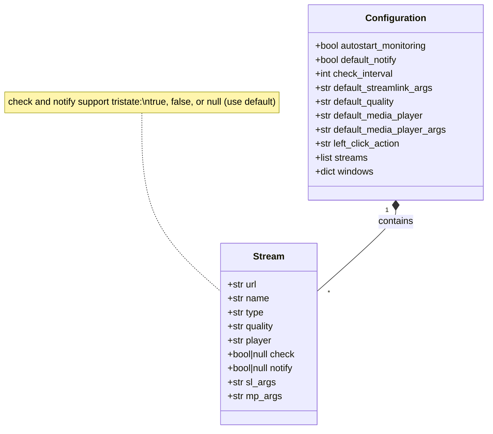

# Configuration Reference

Complete reference for StreamCondor's configuration file format and options.

## Table of Contents

- [Configuration File Location](#configuration-file-location)
- [File Format](#file-format)
- [Global Settings](#global-settings)
- [Stream Configuration](#stream-configuration)
- [Advanced Options](#advanced-options)
- [Variable Substitution](#variable-substitution)
- [Configuration Examples](#configuration-examples)
- [Migration Guide](#migration-guide)

## Configuration File Location

### Default Paths

**Linux (XDG-compliant)**:
```bash
~/.config/StreamCondor.json
```

**Windows**:
```
%APPDATA%\StreamCondor.json
# Typically: C:\Users\YourName\AppData\Roaming\StreamCondor.json
```

**macOS**:
```bash
~/Library/Application Support/StreamCondor.json
```

### Custom Configuration Path

Override the default location using command-line argument:

```bash
python src/main.py -c /path/to/custom_config.json
```

## File Format

### Structure Overview

```json
{
  "autostart_monitoring": true,
  "default_notify": true,
  "check_interval": 60,
  "default_streamlink_args": "--retry-max 5",
  "default_quality": "best",
  "default_media_player": "mpv",
  "default_media_player_args": "",
  "left_click_action": "open_config",
  "streams": [
    {
      "url": "https://www.twitch.tv/username",
      "name": "Display Name",
      "type": "twitch",
      "quality": "720p",
      "player": "mpv",
      "check": true,
      "notify": true,
      "sl_args": "",
      "mp_args": "--no-border"
    }
  ],
  "windows": {
    "settings_window": {
      "x": 0,
      "y": 0,
      "width": 796,
      "height": 738
    }
  }
}
```

### Data Types



## Global Settings

### Monitoring Settings

#### `autostart_monitoring`

**Type**: `boolean`
**Default**: `true`
**Description**: Start stream monitoring automatically when application launches.

```json
{
  "autostart_monitoring": true
}
```

**Use Cases**:
- `true` - Always monitor streams on startup
- `false` - Manually enable monitoring when needed

---

#### `check_interval`

**Type**: `integer` (seconds)
**Default**: `60`
**Range**: `10` to `3600`
**Description**: Time between stream status checks.

```json
{
  "check_interval": 60
}
```

**Recommended Values**:
- `30` - Frequent updates (higher API usage)
- `60` - Balanced (default)
- `120` - Less frequent (lower resource usage)
- `300` - Infrequent (minimal overhead)

**Considerations**:
- Lower values = faster detection, higher network/API usage
- Higher values = delayed detection, lower resource usage
- Platforms may rate-limit frequent checks

---

### Notification Settings

#### `default_notify`

**Type**: `boolean`
**Default**: `true`
**Description**: Default notification state for new streams.

```json
{
  "default_notify": true
}
```

**Behavior**:
- `true` - Show notifications when streams go live (unless stream overrides)
- `false` - Suppress notifications (unless stream overrides)

**Note**: Individual streams can override this with their `notify` field.

---

### Streamlink Settings

#### `default_streamlink_args`

**Type**: `string`
**Default**: `""`
**Description**: Global streamlink arguments applied to all streams.

```json
{
  "default_streamlink_args": "--retry-max 5 --retry-streams 3"
}
```

**Common Options**:
```bash
--retry-max N           # Max number of retries
--retry-streams DELAY   # Retry stream access (seconds)
--hls-live-edge N       # Number of segments from live edge
--hls-segment-threads N # Parallel segment downloads
--stream-timeout N      # Stream timeout (seconds)
--title TEXT            # Window title (with $SC.name)
```

**See Also**: [Streamlink CLI Documentation](https://streamlink.github.io/cli.html)

---

#### `default_quality`

**Type**: `string`
**Default**: `"best"`
**Description**: Default stream quality preference.

```json
{
  "default_quality": "best"
}
```

**Standard Values**:
- `best` - Highest available quality
- `worst` - Lowest available quality
- `1080p60`, `1080p`, `720p60`, `720p`, `480p`, `360p`, `160p` - Specific resolutions
- `source` - Original source quality (platform-specific)

**Quality Selection Logic**:
1. Try exact match (e.g., `720p`)
2. Fall back to nearest lower quality if exact not available
3. Use `best` if no match found

---

### Media Player Settings

#### `default_media_player`

**Type**: `string`
**Default**: `"mpv"`
**Description**: Default media player executable.

```json
{
  "default_media_player": "mpv"
}
```

**Supported Players**:
- `mpv` - mpv media player (recommended)
- `vlc` - VLC media player
- `mplayer` - MPlayer
- Custom player executable name (must be in PATH)

**Requirements**:
- Player must be installed and in system PATH
- Player must support stdin streaming or URL playback

---

#### `default_media_player_args`

**Type**: `string`
**Default**: `""`
**Description**: Default arguments passed to media player.

```json
{
  "default_media_player_args": "--no-border --no-osc"
}
```

**mpv Examples**:
```bash
--no-border             # Remove window border
--no-osc                # Hide on-screen controller
--fs                    # Start fullscreen
--volume=50             # Set initial volume
--loop                  # Loop playback
--keep-open             # Keep window open after stream ends
```

**VLC Examples**:
```bash
--no-video-title-show   # Don't show title overlay
--fullscreen            # Start fullscreen
--volume 50             # Initial volume
--loop                  # Loop playback
```

---

### UI Settings

#### `left_click_action`

**Type**: `string` (enum)
**Default**: `"open_config"`
**Description**: Action performed when left-clicking tray icon.

```json
{
  "left_click_action": "open_config"
}
```

**Valid Values**:

| Value | Action | Description |
|-------|--------|-------------|
| `open_config` | Open Settings | Open settings window |
| `open_url` | Open URL Dialog | Show URL input dialog |
| `toggle_monitoring` | Toggle Monitoring | Enable/disable monitoring |
| `toggle_notifications` | Toggle Notifications | Enable/disable notifications |
| `nothing` | No Action | Do nothing |

**Use Cases**:
- `open_config` - Frequently edit streams
- `open_url` - Quick ad-hoc stream launching
- `toggle_monitoring` - Quick monitoring on/off
- `nothing` - Prevent accidental clicks

---

## Stream Configuration

### Required Fields

#### `url`

**Type**: `string`
**Required**: Yes
**Description**: Full URL of the stream.

```json
{
  "url": "https://www.twitch.tv/username"
}
```

**Supported Platforms** (via streamlink):
- Twitch: `https://www.twitch.tv/username`
- YouTube: `https://www.youtube.com/@channel` or `https://www.youtube.com/watch?v=VIDEO_ID`
- And [700+ more platforms](https://streamlink.github.io/plugins.html)

---

#### `name`

**Type**: `string`
**Default**: URL
**Description**: Display name for the stream.

```json
{
  "name": "My Favorite Streamer"
}
```

**Tips**:
- Keep names short for tray menu readability
- Use descriptive names for multiple streams from same platform
- Names are used in notifications and dialogs

---

#### `type`

**Type**: `string`
**Auto-detected**: Yes
**Description**: Platform type identifier.

```json
{
  "type": "twitch"
}
```

**Common Types**:
- `twitch` - Twitch.tv
- `youtube` - YouTube
- `kick` - Kick.com

**Note**: Automatically determined by Streamlink.

---

### Optional Fields

#### `quality`

**Type**: `string`
**Default**: Global `default_quality`
**Description**: Stream quality for this specific stream.

```json
{
  "quality": "720p"
}
```

**Override Example**:
```json
{
  "default_quality": "best",
  "streams": [
    {
      "url": "https://www.twitch.tv/hiquality",
      "name": "High Quality",
      "quality": "1080p60"
    },
    {
      "url": "https://www.twitch.tv/lowbandwidth",
      "name": "Low Bandwidth",
      "quality": "360p"
    }
  ]
}
```

---

#### `player`

**Type**: `string`
**Default**: Global `default_media_player`
**Description**: Media player for this specific stream.

```json
{
  "player": "vlc"
}
```

**Use Case**: Different players for different stream types (e.g., VLC for video, mpv for audio).

---

#### `check`

**Type**: `boolean | null`
**Default**: `true`
**Description**: Enable monitoring for this stream.

```json
{
  "check": true
}
```

**Tristate Values**:
- `true` - Always check (even if monitoring globally disabled)
- `false` - Never check (even if monitoring globally enabled)
- `null` (omit field) - Follow global monitoring state

**Use Case**: Disable checking for streams you manually launch.

---

#### `notify`

**Type**: `boolean | null`
**Default**: Global `default_notify`
**Description**: Enable notifications for this stream.

```json
{
  "notify": false
}
```

**Tristate Values**:
- `true` - Always notify (override global default)
- `false` - Never notify (override global default)
- `null` (omit field) - Use global `default_notify`

**Use Cases**:
- `true` - Important streams you never want to miss
- `false` - Streams you monitor but don't need notifications for
- `null` - Follow global notification setting

---

#### `sl_args`

**Type**: `string`
**Default**: Empty (uses global `default_streamlink_args`)
**Description**: Additional streamlink arguments for this stream.

```json
{
  "sl_args": "--title \"$SC.name\" --retry-max 10"
}
```

**Merging Behavior**:
1. Start with global `default_streamlink_args`
2. Append stream-specific `sl_args`
3. Remove duplicate options (last occurrence wins)

**Example**:
```json
{
  "default_streamlink_args": "--retry-max 5 --hls-live-edge 3",
  "streams": [
    {
      "url": "https://www.twitch.tv/username",
      "sl_args": "--retry-max 10"
    }
  ]
}
```

**Result**: `--hls-live-edge 3 --retry-max 10` (stream override wins)

---

#### `mp_args`

**Type**: `string`
**Default**: Empty (uses global `default_media_player_args`)
**Description**: Additional media player arguments for this stream.

```json
{
  "mp_args": "--fs --volume=75"
}
```

**Merging Behavior**: Same as `sl_args`.

---

## Advanced Options

### Window Geometry Persistence

```json
{
  "windows": {
    "settings_window": {
      "x": 0,
      "y": 0,
      "width": 796,
      "height": 738
    }
  }
}
```

**Description**: Automatically saved window positions and sizes.

**Fields**:
- `x` - Window X coordinate (pixels from left edge)
- `y` - Window Y coordinate (pixels from top edge)
- `width` - Window width in pixels
- `height` - Window height in pixels

**Note**: Managed automatically by application, do not edit manually.

---

## Variable Substitution

### Available Variables

| Variable | Description | Example Value |
|----------|-------------|---------------|
| `$SC.name` | Stream display name | `"My Streamer"` |
| `$SC.type` | Platform type | `"twitch"` |

### Usage in Arguments

**Streamlink Arguments**:
```json
{
  "sl_args": "--title \"$SC.name - $SC.type\""
}
```

**Substituted Command**:
```bash
streamlink --title "My Streamer - twitch" https://www.twitch.tv/...
```

**Media Player Arguments**:
```json
{
  "mp_args": "--force-media-title=\"$SC.name\""
}
```

**Substituted Command**:
```bash
mpv --force-media-title="My Streamer" -
```

### Escaping Special Characters

```json
{
  "sl_args": "--title \"[Live] $SC.name ($SC.type)\""
}
```

**Result**: `--title "[Live] My Streamer (twitch)"`

---

## Configuration Examples

### Minimal Configuration

```json
{
  "streams": [
    {
      "url": "https://www.twitch.tv/username"
    }
  ]
}
```

All other settings use defaults.

---

### Basic Configuration

```json
{
  "autostart_monitoring": true,
  "default_notify": true,
  "check_interval": 60,
  "default_quality": "best",
  "default_media_player": "mpv",
  "streams": [
    {
      "url": "https://www.twitch.tv/username",
      "name": "Twitch Streamer"
    },
    {
      "url": "https://www.youtube.com/@channel",
      "name": "YouTube Channel"
    }
  ]
}
```

---

### Advanced Configuration

```json
{
  "autostart_monitoring": true,
  "default_notify": true,
  "check_interval": 90,
  "default_streamlink_args": "--retry-max 5 --hls-live-edge 3",
  "default_quality": "720p",
  "default_media_player": "mpv",
  "default_media_player_args": "--no-border --no-osc",
  "left_click_action": "open_url",
  "streams": [
    {
      "url": "https://www.twitch.tv/important_stream",
      "name": "Important Stream",
      "quality": "best",
      "notify": true,
      "sl_args": "--title \"$SC.name\" --retry-max 10"
    },
    {
      "url": "https://www.twitch.tv/casual_stream",
      "name": "Casual Stream",
      "quality": "480p",
      "notify": false,
      "mp_args": "--volume=50"
    },
    {
      "url": "https://www.youtube.com/@channel",
      "name": "YouTube VODs",
      "check": false,
      "player": "vlc",
      "mp_args": "--fullscreen"
    }
  ]
}
```

---

### Multi-Platform Configuration

```json
{
  "check_interval": 60,
  "default_quality": "best",
  "streams": [
    {
      "url": "https://www.twitch.tv/twitch_user",
      "name": "Twitch Stream",
      "type": "twitch"
    },
    {
      "url": "https://www.youtube.com/@youtube_channel",
      "name": "YouTube Live",
      "type": "youtube"
    },
    {
      "url": "https://kick.com/kick_user",
      "name": "Kick Stream",
      "type": "kick"
    }
  ]
}
```

---

### Tristate Notification Examples

```json
{
  "default_notify": true,
  "streams": [
    {
      "url": "https://www.twitch.tv/must_notify",
      "name": "Must Notify",
      "notify": true
    },
    {
      "url": "https://www.twitch.tv/never_notify",
      "name": "Never Notify",
      "notify": false
    },
    {
      "url": "https://www.twitch.tv/use_default",
      "name": "Use Default"
    }
  ]
}
```

**Behavior**:
- "Must Notify" - Always shows notifications (even if default_notify=false)
- "Never Notify" - Never shows notifications (even if default_notify=true)
- "Use Default" - Follows default_notify setting

---

## Migration Guide

### From Version 0.x to 1.0

**Changes**:
1. Configuration file renamed from `streamcondor.json` to `StreamCondor.json`
2. Added `left_click_action` field
3. Added window geometry persistence

**Migration Steps**:

```bash
# Backup old config
cp ~/.config/streamcondor.json ~/.config/streamcondor.json.backup

# Rename to new location
mv ~/.config/streamcondor.json ~/.config/StreamCondor.json

# Add new field (optional)
# Edit ~/.config/StreamCondor.json and add:
# "left_click_action": "open_config"
```

**Automatic Migration**: Application will automatically add missing fields with defaults on first run.

---

### Manual Editing Tips

1. **Validate JSON** after manual edits:
   ```bash
   python -m json.tool ~/.config/StreamCondor.json
   ```

2. **Backup before editing**:
   ```bash
   cp ~/.config/StreamCondor.json ~/.config/StreamCondor.json.backup
   ```

3. **Test with sample config**:
   ```bash
   python src/main.py -c test_config.json
   ```

4. **Pretty-print** for readability:
   ```bash
   python -m json.tool input.json > output.json
   ```

---

## Troubleshooting

### Configuration Not Loading

**Symptoms**: Changes don't persist, application uses defaults.

**Solutions**:
1. Check file permissions:
   ```bash
   ls -la ~/.config/StreamCondor.json
   ```

2. Validate JSON syntax:
   ```bash
   python -m json.tool ~/.config/StreamCondor.json
   ```

3. Check for write errors in logs:
   ```bash
   python src/main.py --log-level DEBUG
   ```

---

### Streams Not Being Checked

**Symptoms**: Monitoring enabled, but streams never go online.

**Solutions**:
1. Verify `check_interval` is reasonable (10-3600 seconds)
2. Check stream `check` field is not `false`
3. Test URL with streamlink directly:
   ```bash
   streamlink https://www.twitch.tv/username
   ```
4. Enable debug logging:
   ```bash
   python src/main.py --log-level DEBUG
   ```

---

### Player Not Launching

**Symptoms**: Notification appears, but player doesn't open.

**Solutions**:
1. Verify player is installed:
   ```bash
   which mpv  # or which vlc
   ```

2. Test streamlink with player:
   ```bash
   streamlink --player mpv https://www.twitch.tv/username best
   ```

3. Check `default_media_player` matches executable name
4. Verify `default_media_player_args` are valid for your player

---

For more information, see [Development Guide](development.md) and [Architecture Overview](architecture.md).
