# Data Flow Documentation

This document details how data moves through StreamCondor, including configuration management, stream monitoring, and user interactions.

## Table of Contents

- [Configuration Flow](#configuration-flow)
- [Stream Monitoring Flow](#stream-monitoring-flow)
- [Stream Launch Flow](#stream-launch-flow)
- [Notification Flow](#notification-flow)
- [Favicon Loading Flow](#favicon-loading-flow)
- [Settings Update Flow](#settings-update-flow)

## Configuration Flow

### Initial Load on Startup

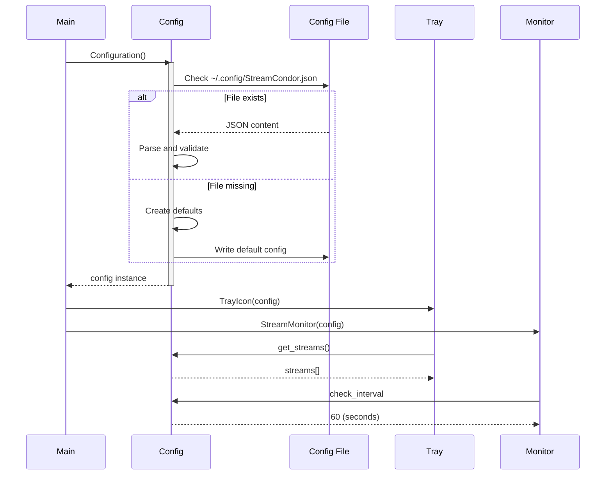

### Configuration Save Flow

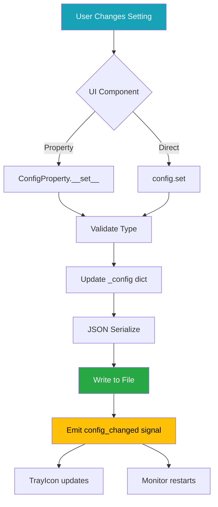

**Auto-Save Example**:
```python
# Property-based auto-save
config.check_interval = 120  # Immediately saved

# Manual save
config.set('custom_key', value)
config.save()
```

### Stream List Modifications

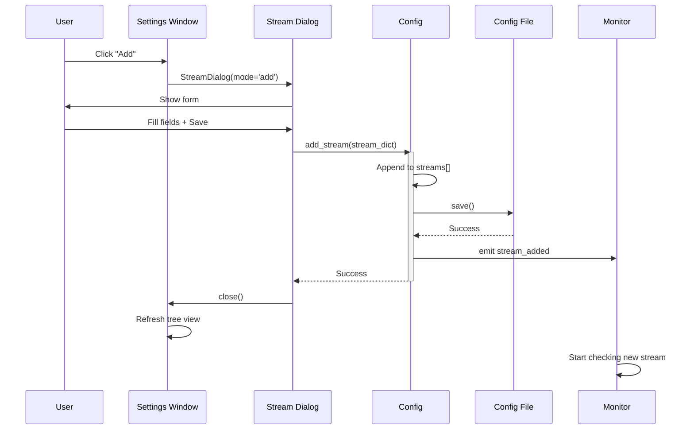

## Stream Monitoring Flow

### Periodic Check Cycle

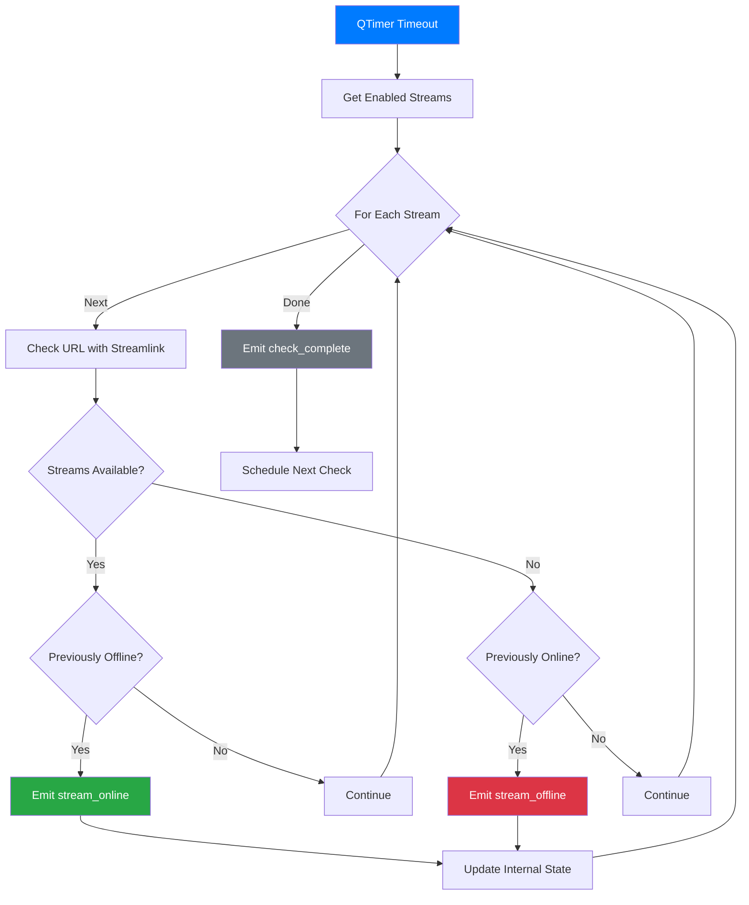

### Status Change Detection

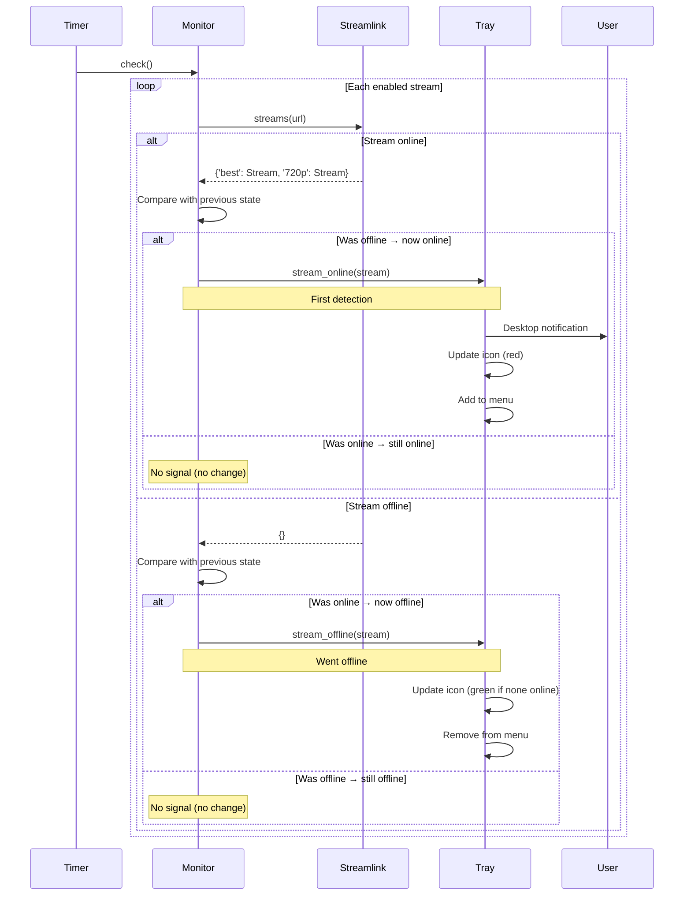

### Error Handling Flow

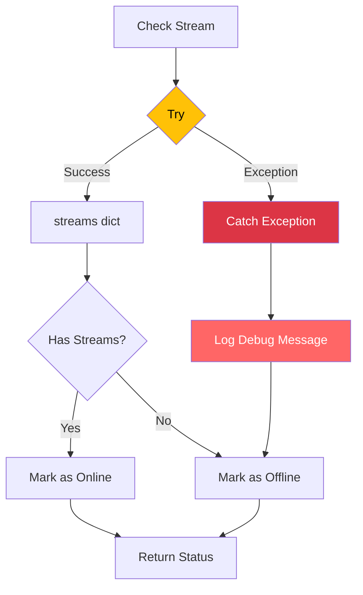

**Error Examples**:
- Network timeout → Mark offline
- Invalid URL → Mark offline
- Streamlink crash → Mark offline
- Plugin error → Mark offline

## Stream Launch Flow

### Complete Launch Sequence

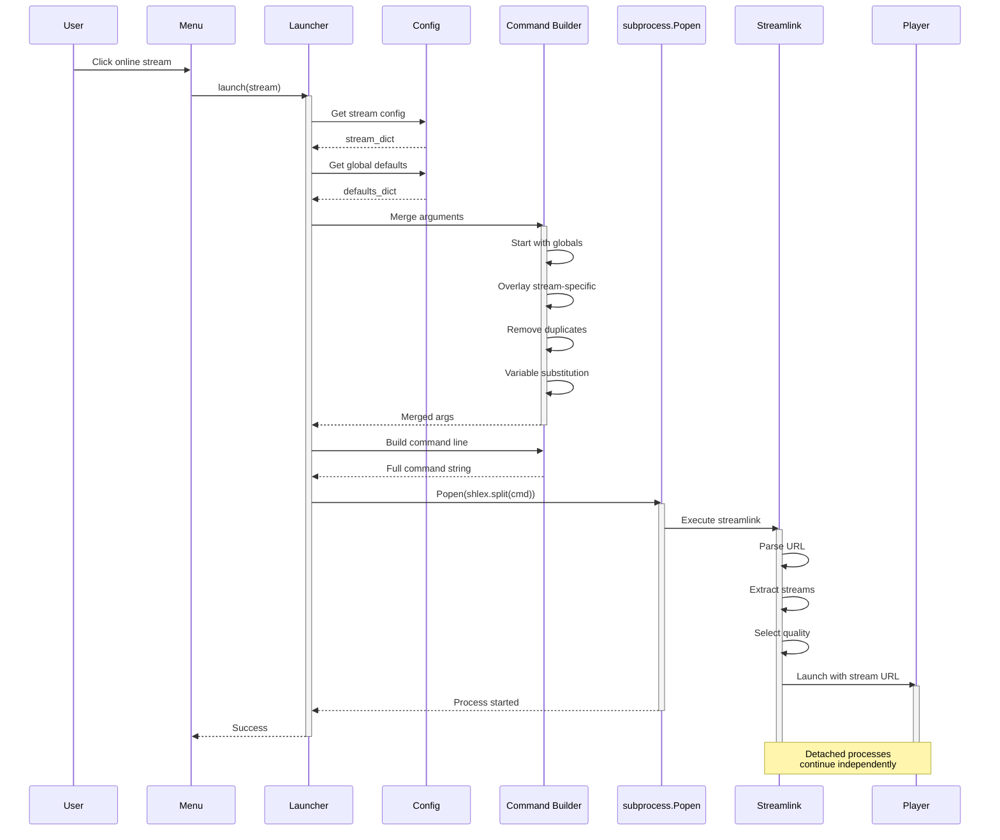

### Argument Merging Logic

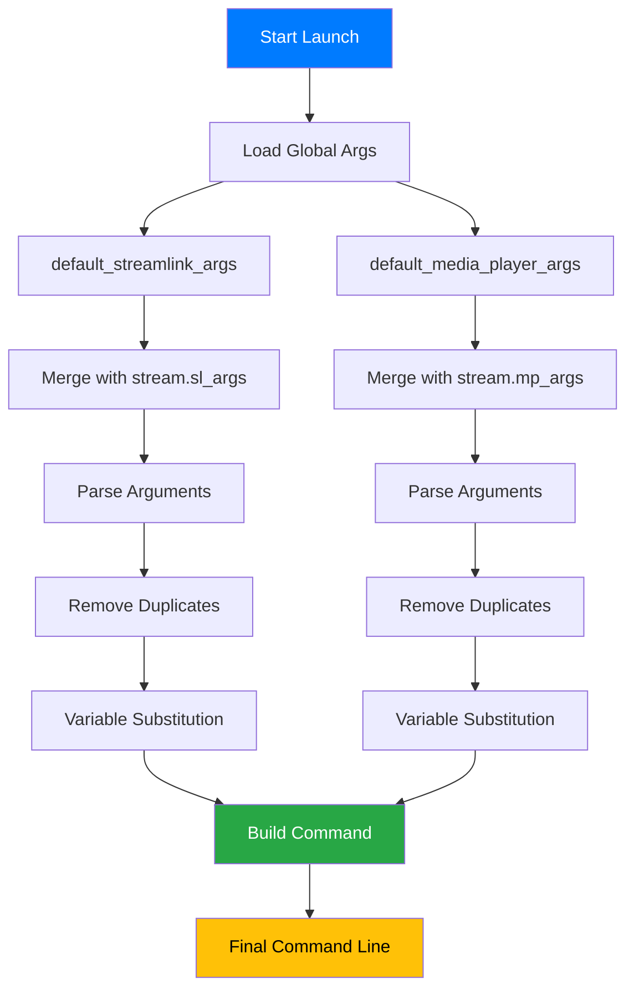

**Example Merging**:
```python
# Global defaults
default_streamlink_args = "--retry-max 5 --retry-streams 3"
default_media_player_args = "--no-border"

# Stream-specific
stream.sl_args = "--retry-max 10 --title \"$SC.name\""
stream.mp_args = "--no-osc"

# Result after merge
streamlink_args = "--retry-streams 3 --retry-max 10 --title \"Streamer Name\""
player_args = "--no-border --no-osc"
```

**Deduplication Rule**: Last occurrence wins (stream overrides global).

### Variable Substitution

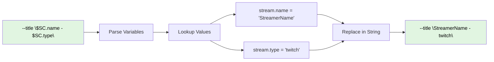

**Available Variables**:
- `$SC.name` → Stream display name
- `$SC.type` → Platform type (twitch, youtube, etc.)

## Notification Flow

### Decision Tree for Notifications

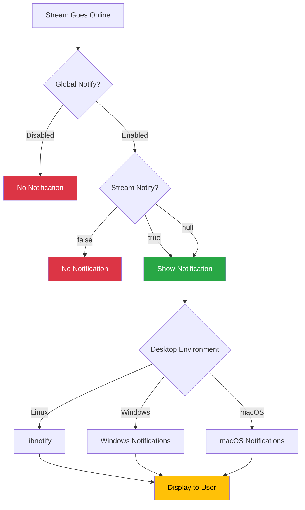

### Tristate Notification Logic

```python
def should_notify(global_notify: bool, stream_notify: bool | None) -> bool:
  """Determine if notification should be shown."""
  if stream_notify is not None:
    return stream_notify  # Explicit override
  return global_notify    # Use default
```

**Truth Table**:

| Global | Stream | Result | Reason |
|--------|--------|--------|--------|
| True   | True   | ✅ Notify | Explicit enable |
| True   | False  | ❌ Don't | Explicit disable |
| True   | None   | ✅ Notify | Use default |
| False  | True   | ✅ Notify | Explicit enable |
| False  | False  | ❌ Don't | Explicit disable |
| False  | None   | ❌ Don't | Use default |

## Favicon Loading Flow

### Complete Favicon Retrieval

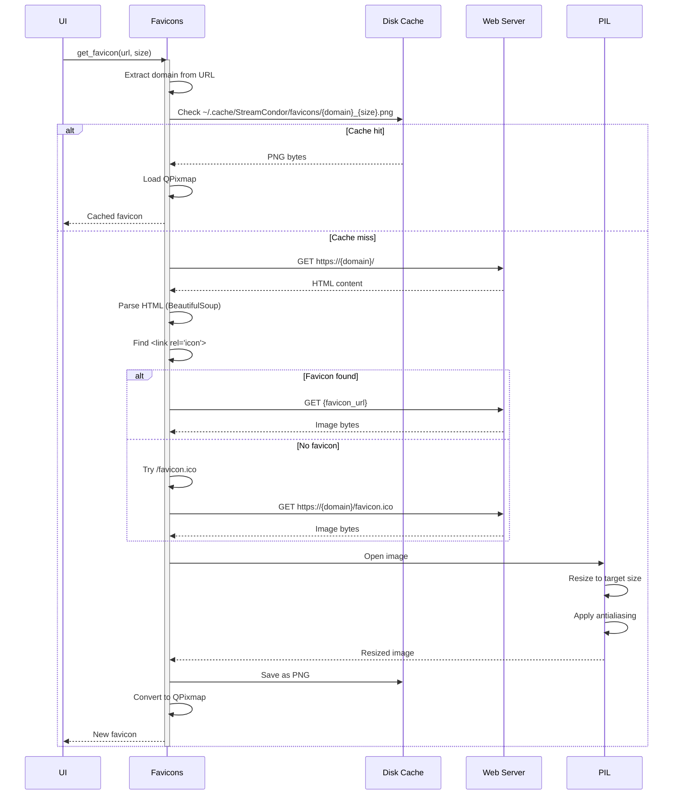

### Favicon URL Resolution

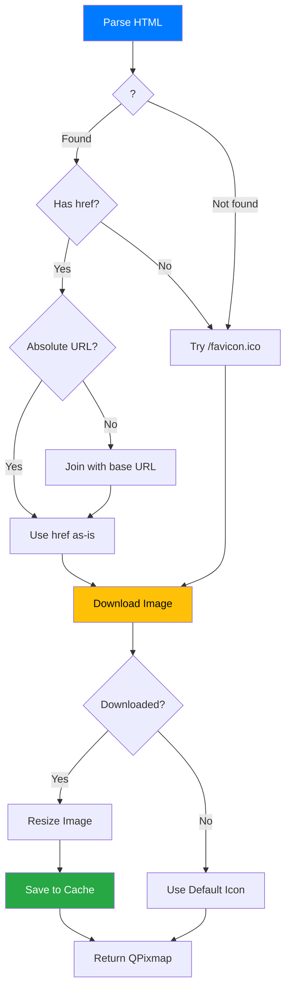

### Size Variants

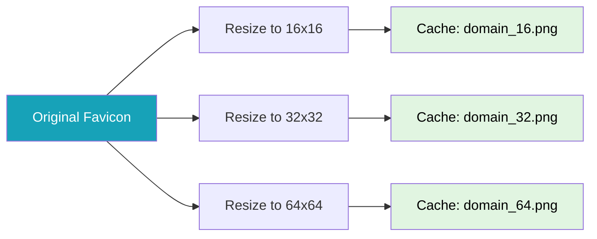

## Settings Update Flow

### Stream Tree Refresh

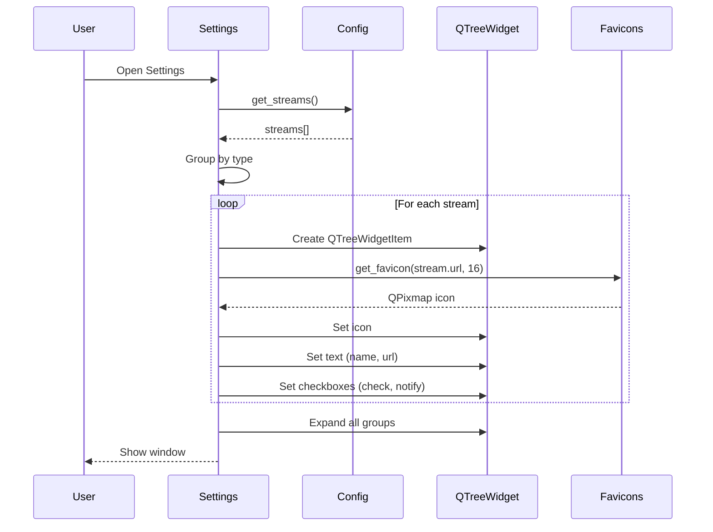

### Stream Edit Propagation

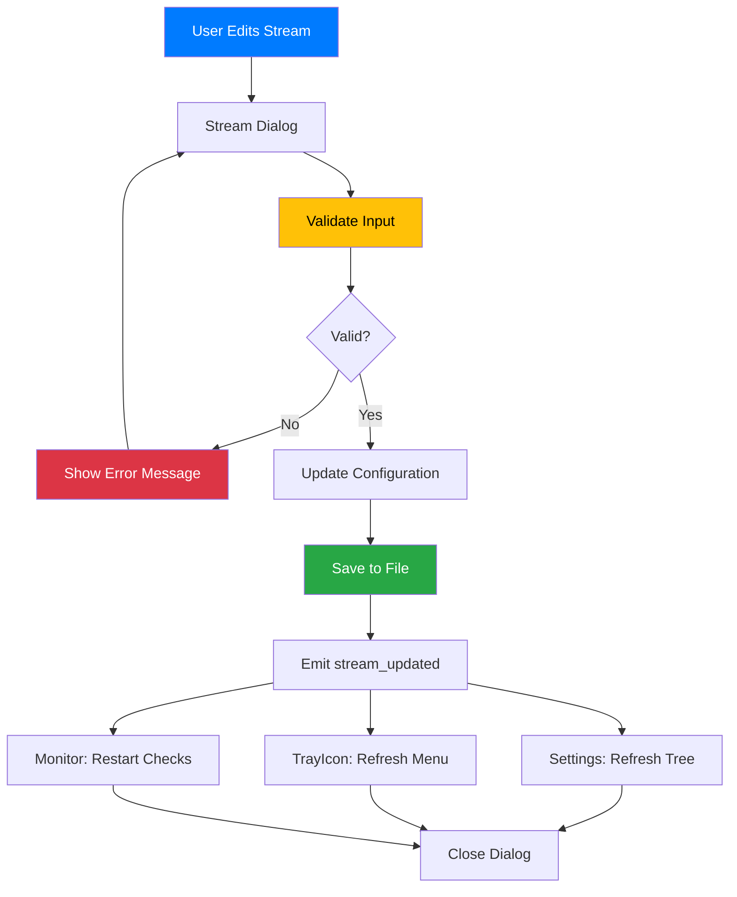

## Performance Optimization

### Lazy Loading Strategy

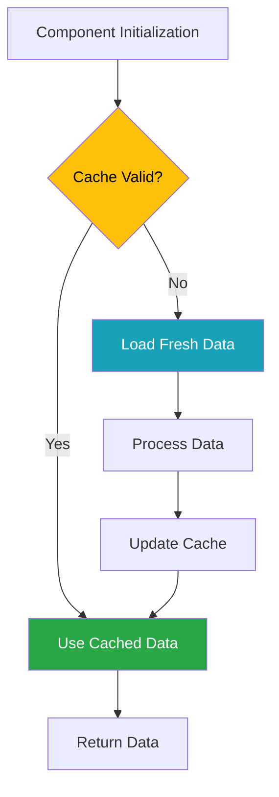

**Lazy-Loaded Components**:
1. **Favicons** - Only loaded when displayed in UI
2. **Stream status** - Only checked for enabled streams
3. **Settings window** - Created on first open
4. **Dialogs** - Created on demand

### Caching Strategy

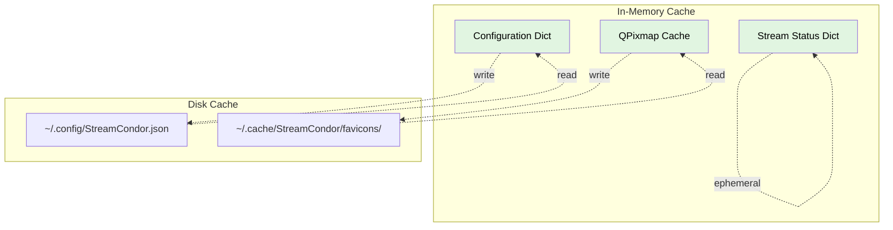

**Cache Lifetimes**:
- **Configuration** - In-memory until app exit, auto-saved on change
- **Favicons** - On disk indefinitely, in memory until widget destroyed
- **Stream status** - In memory only, refreshed every check interval

---

For more details on specific components, see [Architecture Overview](architecture.md).
