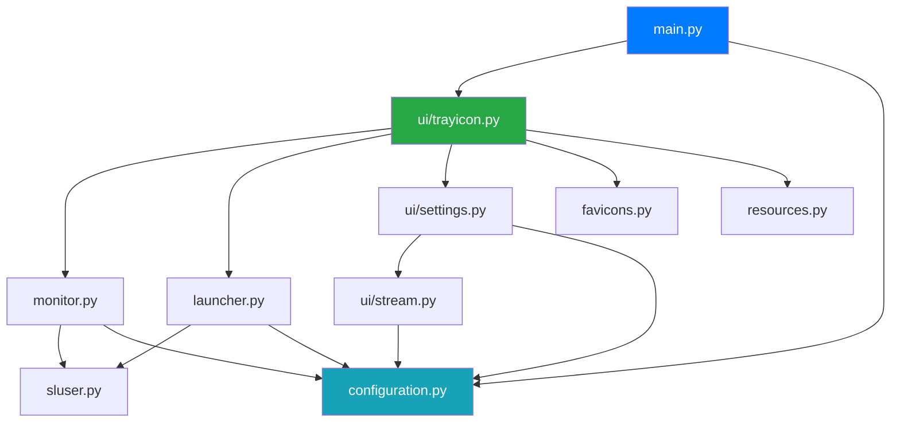
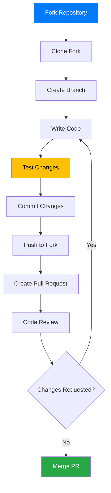

# Development Guide

Complete guide for developing, testing, and contributing to StreamCondor.

## Table of Contents

- [Getting Started](#getting-started)
- [Project Structure](#project-structure)
- [Development Workflow](#development-workflow)
- [Coding Standards](#coding-standards)
- [Testing](#testing)
- [Debugging](#debugging)
- [Building and Packaging](#building-and-packaging)
- [Contributing](#contributing)

## Getting Started

### Prerequisites

Install required development tools:

```bash
# Python 3.12+
python3 --version

# pip and venv
python3 -m pip --version

# streamlink (system package)
streamlink --version

# Git
git --version
```

### Clone and Setup

```bash
# Clone repository
git clone https://github.com/tarzasai/StreamCondor.git
cd streamcondor

# Run setup script
bash setup_dev.sh

# Or manually:
python3 -m venv .venv
source .venv/bin/activate
pip install -r requirements.txt
```

### Verify Installation

```bash
# Run application
python src/main.py

# Run with debug logging
python src/main.py --log-level DEBUG

# Check imports
python -c "import PyQt6; import streamlink; print('OK')"
```

## Project Structure

### Directory Layout

```
streamcondor/
├── .github/
│   └── copilot-instructions.md    # AI assistant guidelines
├── src/
│   ├── __init__.py                # Package version
│   ├── main.py                    # Application entry point
│   ├── configuration.py           # Config management
│   ├── monitor.py                 # Stream monitoring thread
│   ├── launcher.py                # Stream launcher
│   ├── favicons.py                # Favicon fetcher
│   ├── resources.py               # Asset path resolution
│   ├── sluser.py                  # Streamlink wrapper
│   ├── assets/                    # Static resources
│   │   ├── icon_monitoring_*.png  # Tray icon states (5 icons)
│   │   ├── logo_*.png             # Application logos
│   │   └── generate_icons.py      # Icon generation script
│   └── ui/
│       ├── trayicon.py            # System tray icon
│       ├── settings.py            # Settings window
│       └── stream.py              # Stream dialog
├── test/
│   ├── __init__.py
│   └── sample_config.json         # Test configuration
├── doc/                           # Extended documentation
│   ├── architecture.md
│   ├── data-flow.md
│   ├── development.md (this file)
│   └── configuration.md
├── setup.py                       # Package setup
├── MANIFEST.in                    # Package manifest
├── requirements.txt               # Python dependencies
├── setup_dev.sh                   # Dev environment setup
├── LICENSE                        # MIT license
└── README.md                      # Project overview
```

### Module Dependencies



## Development Workflow

### Branching Strategy

```bash
# Create feature branch
git checkout -b feature/your-feature-name

# Create bugfix branch
git checkout -b fix/issue-description

# Create documentation branch
git checkout -b docs/topic-name
```

### Development Cycle


### Running During Development

```bash
# Activate virtual environment
source .venv/bin/activate

# Run from source
python src/main.py

# Run with custom config
python src/main.py -c test/sample_config.json

# Run with debug logging
python src/main.py --log-level DEBUG

# Test specific functionality
python -c "from src.launcher import StreamLauncher; print('OK')"
```

## Coding Standards

### Style Guide

Follow PEP 8 with these project-specific conventions:

#### Indentation

**2 spaces** (project convention):

```python
def example_function():
  if condition:
    do_something()
    if nested:
      do_more()
```

#### Line Length

**120 characters maximum**:

```python
# Good
stream_url = 'https://www.twitch.tv/very_long_username_that_needs_wrapping'

# Too long - split it
very_long_function_call_with_many_parameters(param1, param2, param3, param4,
                                              param5, param6)

# Better
very_long_function_call_with_many_parameters(
  param1, param2, param3,
  param4, param5, param6
)
```

#### Naming Conventions

```python
# Functions and variables: snake_case
def check_stream_status(stream_url: str) -> bool:
  is_online = False
  return is_online

# Classes: PascalCase
class StreamMonitor(QThread):
  pass

# Constants: UPPER_CASE
MAX_RETRY_COUNT = 5
DEFAULT_CHECK_INTERVAL = 60

# Private methods: _leading_underscore
def _internal_helper(self) -> None:
  pass
```

#### Type Hints

**Use Python 3.12 native syntax** (avoid `typing` module):

```python
# Good - Native types
def process_streams(
  streams: list[dict[str, Any]],
  threshold: float = 0.5
) -> list[str]:
  return [s['url'] for s in streams]

# Good - Union operator
def get_config(key: str) -> str | int | None:
  return config.get(key)

# Avoid - Old typing module
from typing import List, Dict, Optional
def old_style(items: List[Dict[str, str]]) -> Optional[int]:
  pass
```

#### Docstrings

Use triple-quoted strings with clear descriptions:

```python
def launch_stream(stream: dict[str, Any], quality: str = 'best') -> bool:
  """Launch a stream with specified quality.

  Args:
    stream: Stream configuration dictionary containing url, name, etc.
    quality: Stream quality to request (best, 720p, etc.)

  Returns:
    True if launch successful, False otherwise.

  Raises:
    ValueError: If stream URL is invalid.
    FileNotFoundError: If player executable not found.
  """
  pass
```

#### Comments

Use inline comments for complex logic:

```python
## Parse and merge streamlink arguments
# Start with global defaults, overlay stream-specific, remove duplicates
merged_args = self._merge_arguments(global_args, stream_args)

# Variable substitution: $SC.name → stream name
final_args = self._substitute_variables(merged_args, stream)
```

### Code Organization

#### Module Structure

```python
"""Module docstring describing purpose."""

# Standard library imports
import json
import logging
from pathlib import Path

# Third-party imports
from PyQt6.QtCore import QThread, pyqtSignal
from PyQt6.QtWidgets import QSystemTrayIcon

# Local imports
from .configuration import Configuration
from .resources import resource_path

# Constants
LOG = logging.getLogger(__name__)
DEFAULT_TIMEOUT = 30

# Classes
class MyClass:
  """Class docstring."""
  pass

# Functions
def my_function():
  """Function docstring."""
  pass

# Module-level code (if needed)
if __name__ == '__main__':
  pass
```

#### Class Structure

```python
class StreamMonitor(QThread):
  """Monitor stream status in background thread."""

  # Signals
  stream_online = pyqtSignal(dict)
  stream_offline = pyqtSignal(dict)

  # Class constants
  MIN_CHECK_INTERVAL = 10
  MAX_CHECK_INTERVAL = 3600

  def __init__(self, config: Configuration):
    """Initialize monitor with configuration."""
    super().__init__()
    self._config = config
    self._stream_status: dict[str, bool] = {}

  # Public methods
  def start_monitoring(self) -> None:
    """Start monitoring enabled streams."""
    pass

  def stop_monitoring(self) -> None:
    """Stop monitoring and cleanup."""
    pass

  # Private methods
  def _check_stream(self, url: str) -> bool:
    """Check if single stream is online."""
    pass

  # Qt overrides
  def run(self) -> None:
    """Thread entry point."""
    pass
```

## Testing

### Manual Testing

```bash
# Test with sample config
python src/main.py -c test/sample_config.json

# Test stream monitoring
# 1. Open Settings
# 2. Add a known live stream
# 3. Enable monitoring
# 4. Wait for notification

# Test stream launching
# 1. Right-click tray icon
# 2. Click online stream
# 3. Verify player opens
```

### Component Testing

```python
# Test configuration
from src.configuration import Configuration
config = Configuration('test_config.json')
config.check_interval = 120
assert config.check_interval == 120

# Test favicon fetching
from src.favicons import Favicons
favicons = Favicons()
icon = favicons.get_favicon('https://www.twitch.tv', 16)
assert icon is not None

# Test launcher command building
from src.launcher import StreamLauncher
from src.configuration import Configuration
launcher = StreamLauncher(Configuration())
# (Add assertions)
```

### Testing Checklist

- [ ] Application starts without errors
- [ ] Tray icon appears and is functional
- [ ] Settings window opens and saves changes
- [ ] Stream monitoring detects online/offline status
- [ ] Notifications appear when streams go live
- [ ] Stream launching opens correct player
- [ ] Configuration persists between sessions
- [ ] Favicons load and display correctly
- [ ] All menu actions work as expected
- [ ] Application exits cleanly

## Debugging

### Logging Levels

```bash
# DEBUG - Detailed diagnostic information
python src/main.py --log-level DEBUG

# INFO - General informational messages (default)
python src/main.py --log-level INFO

# WARNING - Warning messages only
python src/main.py --log-level WARNING

# ERROR - Error messages only
python src/main.py --log-level ERROR
```

### Debug Output Examples

```python
# Add debug logging to your code
import logging
log = logging.getLogger(__name__)

log.debug(f'Checking stream: {url}')
log.info(f'Stream online: {stream_name}')
log.warning(f'Slow response from {url}')
log.error(f'Failed to launch stream: {e}')
```

### Common Issues

#### Import Errors

```bash
# Problem: ModuleNotFoundError
# Solution: Ensure virtual environment is activated
source .venv/bin/activate
pip install -r requirements.txt

# Verify imports
python -c "import PyQt6; import streamlink"
```

#### Tray Icon Not Showing

```bash
# Problem: Tray icon doesn't appear
# Solution: Check desktop environment support
echo $XDG_CURRENT_DESKTOP  # Should show GNOME, KDE, etc.

# Try alternative platform
QT_QPA_PLATFORM=xcb python src/main.py
```

#### Stream Not Launching

```bash
# Problem: Stream doesn't open
# Solution: Test streamlink directly
streamlink https://www.twitch.tv/username best

# Check player
which mpv  # Or which vlc

# Enable debug mode
python src/main.py --log-level DEBUG
# Right-click > Online stream
# Check terminal output
```

#### Configuration Not Saving

```bash
# Problem: Changes don't persist
# Solution: Check file permissions
ls -la ~/.config/StreamCondor.json

# Manually verify JSON
cat ~/.config/StreamCondor.json | python -m json.tool
```

### Debug Tools

#### Qt Inspector

```python
# Add to main.py for GUI debugging
from PyQt6.QtCore import Qt
app.setAttribute(Qt.ApplicationAttribute.AA_UseDesktopOpenGL)

# Enable Qt debug output
import os
os.environ['QT_DEBUG_PLUGINS'] = '1'
```

#### Streamlink Debug Mode

```bash
# Test streamlink with verbose output
streamlink --loglevel debug https://www.twitch.tv/username best

# Check available streams
streamlink https://www.twitch.tv/username
```

## Building and Packaging

### Local Installation

```bash
# Install in development mode
pip install -e .

# Test installed version
streamcondor --help

# Uninstall
pip uninstall streamcondor
```

### Building Distribution

```bash
# Install build tools
pip install build wheel

# Build source and wheel distributions
python -m build

# Output:
# dist/streamcondor-1.0.0.tar.gz
# dist/streamcondor-1.0.0-py3-none-any.whl
```

### PyInstaller (Single Executable)

```bash
# Install PyInstaller
pip install pyinstaller

# Create executable
pyinstaller --onefile \
  --windowed \
  --name StreamCondor \
  --icon assets/logo.png \
  --add-data "src/assets:assets" \
  src/main.py

# Output: dist/StreamCondor
```

### Testing Package

```bash
# Create fresh virtual environment
python3 -m venv test_env
source test_env/bin/activate

# Install built package
pip install dist/streamcondor-1.0.0-py3-none-any.whl

# Test
streamcondor

# Cleanup
deactivate
rm -rf test_env
```

## Contributing

### Contribution Workflow



### Pull Request Guidelines

**Title Format**:
```
[Category] Brief description

Examples:
[Feature] Add support for kick.com streams
[Fix] Correct favicon caching issue
[Docs] Update installation instructions
[Refactor] Simplify argument merging logic
```

**Description Template**:
```markdown
## Description
Brief overview of changes.

## Changes
- Specific change 1
- Specific change 2

## Testing
How was this tested?

## Related Issues
Fixes #123
Closes #456
```

### Commit Message Format

```bash
# Format: [Category] Brief description
git commit -m "[Feature] Add kick.com platform support"
git commit -m "[Fix] Resolve tray icon memory leak"
git commit -m "[Docs] Add architecture diagrams"

# Categories: Feature, Fix, Docs, Refactor, Test, Chore
```

### Code Review Checklist

- [ ] Code follows project style guide (2-space indent, 120 chars)
- [ ] Type hints use Python 3.12 native syntax
- [ ] Docstrings present for public functions/classes
- [ ] No breaking changes to configuration format
- [ ] Testing performed and documented
- [ ] Documentation updated if needed
- [ ] No new dependencies without discussion

### Areas for Contribution

#### High Priority

- **Testing** - Unit tests for core modules
- **Platform Support** - Additional streaming platforms
- **Documentation** - Usage examples, troubleshooting guides
- **UI Polish** - Icon improvements, dark mode support

#### Medium Priority

- **Features** - Stream recording, notification templates
- **Performance** - Parallel stream checking, caching improvements
- **Accessibility** - Keyboard navigation, screen reader support

#### Low Priority

- **Integrations** - Discord notifications, OBS integration
- **Advanced Features** - Multi-profile support, statistics tracking
- **Packaging** - Flatpak, AppImage, Snap packages

### Development Environment Tips

```bash
# Use pre-commit hooks (optional)
pip install pre-commit
pre-commit install

# Auto-format code (if using)
pip install black
black --line-length 120 src/

# Type checking (if using)
pip install mypy
mypy src/

# Linting
pip install pylint
pylint src/
```

### Getting Help

- **Documentation** - Start with README.md and doc/
- **Code Examples** - Check test/ directory for usage
- **Issues** - Search existing issues on GitHub
- **Discussions** - Start a discussion for questions
- **Code Review** - Tag maintainers in PR for review

---

For architectural details, see [Architecture Overview](architecture.md).
For data flow information, see [Data Flow](data-flow.md).
